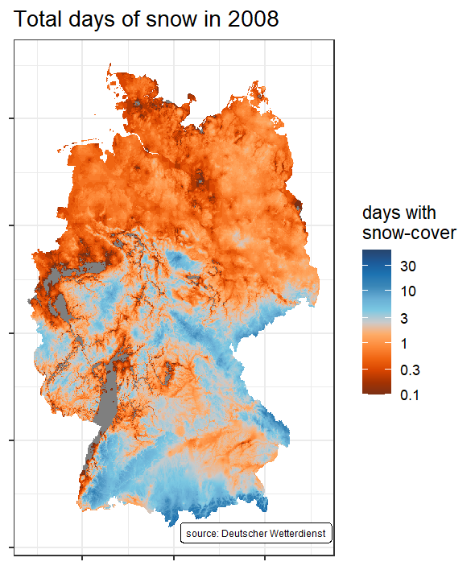

Many tasks in the realm of Hydrogeology require data from meteorological observations to be taken into account. If you are working on such a project that happens to be located in Germany, you can count yourself lucky, because the [Deutscher Wetterdienst](www.dwd.de) (DWD, German Meteorological Service) is providing a cornucopia of both brand new and historic data for free via its [climate datacenter](https://opendata.dwd.de/climate_environment/CDC/) (CDC). The interface to that server, however, can be somewhat confusing at first, due to the mass of very different data formats and the poignant absence of any meaningful GUI. In this post we will therefore explore how we can use [R](www.r-project.org) and specifically the [rdwd](https://cran.r-project.org/web/packages/rdwd/index.html) library to access data from the CDC and turn it into a (hopefully) meaningful visualization.

  For demonstration purposes, let's look at how the number of days with snowcover changed in Germany over the years, a task I came up with this winter, while looking out of the window and, well, missing snow. As mentioned, we will use R-package rdwd, which [ships with an excellent documentation](https://bookdown.org/brry/rdwd/) that we can use to look up how to find the data we are interested in, download it and load it into R.
  
  By and at large, DWD-datasets can be divided into two categories:

  1. Data associated with a discrete weather station
  2. Gridded data spanning a larger area (usually all of Germany)

  As we are interested in snow cover data for all of Germany, we will look into the gridded data.
  
```{r locate_data, warning=FALSE, message=FALSE}
# first let's get our R-session set up properly
library(tidyverse) # this is for data-wrangling and -visualisation 
library(rdwd) # this is where we get our data from
library(raster) # this will help us work with raster data
library(sp) # this is used here to convert between spatial data formats
library(paletteer) # pretty color palettes for plots
library(magick) # his will be used to render the final animation

# The next step is to locate the data we are interested in on the CDC-Server

# Load the adresses of all available files 
data(gridIndex)
# only keep the adresses of data we are interested in
links <- gridIndex[str_detect(gridIndex, "^annual/snowcover_days/grids")]
head(links, n = 3) #inspect what we've got
tail(links, n = 3)
```

  So we managed to locate the position of 68 files of gridded snow-cover data. Each file contains the data for a single year and we have files spanning the period from 1951 to 2018. Now that we know where we can find the data, the next steps are:
  
  * Downloading the data to your hard disc
  * Actually loading the data into R
  * Shaping the data into a format to work on with
  
  This is achieved mainly by two functions provided by `rdwd`. We will download the data with `dataDWD` and load it with `readDWD`. Please note that the downloaded files are stored on your hard drive and take up approximately 200 MB of space. As we need to download all 68 files, we will iterate over every element of `links`, applying the function-in-question on the way.
  
```{r show_data_grab, eval = FALSE}

map(
  links, 
  dataDWD, 
  base = gridbase, 
  joinbf = TRUE, 
  read = FALSE
  )

# Executed like this, the downloaded files will be stored in a subdirectory
# named "DWDdata/". Let's see what we've got!

lokallinks <- list.files("DWDdata/")

# In the next step we will do something a bit more complex.
# The goal is to load the downloaded files into R and give them a structure
# that is convenient to work with. As we want this to happen with all 68
# files, we will define a function that loads a file and returns the data 
# in the desired way and then apply said function to every file.

grabmydata <- function(file){
  
  # first let's load the data and store it in a nice data.frame
  df <- readDWD(paste0("DWDdata/", file)) %>% 
    as("SpatialPixelsDataFrame") %>% 
    as.data.frame()
  
  # give it some nice coloumn names
  colnames(df) <- c("value", "x", "y")
  
  # next we want to know the year that the data corresponds to
  year <- file %>% 
    str_remove("annual_snowcover_days_grids_germany_annual_snowcover_days_") %>% 
    str_remove("_17.asc.gz") %>% 
    as.integer()
  
  # Now just store the year as another variable in the data.frame
  df %>% mutate(year = year)
}

# Now that we have a function that knows how to handle a file, iterate over
# all files and append the result rowwise.
df <- map_dfr(lokallinks, grabmydata)

```

  Now that we have all the data nicely loaded into our global environment, we can start visualizing them. In a first step, let's look at the situation in the year 2008. We can later expand this to include all years.
  
  There is one little catch, though. To make the figure more visually appealing, we will apply a logarithmic color gradient, while keeping the actual scale linear.
  
```{r create_singleplot, eval = FALSE}

df_08 <- df %>% 
  filter(year == 2008)

# In the plot legend we want to see what the color looks like for the following 
# numbers of days of snow cover:

snow_days_legend <- c(0.1, 0.3, 1, 3, 10, 30)

ggplot(
  data = df_08,
  aes(
    x = x,
    y = y,
    fill = log10(value)
  )
) +
  geom_tile() +
    annotate(
      geom = "label", x = max(df$x) - 140000, y = min(df$y) - 10000,
      label = "source: Deutscher Wetterdienst",
      size = 2
    ) +
  labs(
    title = "Total days of snow in 2008",
    fill = "days with\nsnow-cover"
  ) +
  scale_fill_paletteer_c(
    "ggthemes::Classic Orange-Blue",
    limits = log10(c(0.1, 60)),
    breaks = log10(snow_days_legend),
    labels = snow_days_legend
  ) +
  theme_bw() +
  theme(
    axis.title = element_blank(),
    axis.text = element_blank(),
  )
  
```

```{r display_single, echo = FALSE, out.width = "400px"}

```

Now this is nice, but it only shows us the situation for a single year, which tells us nothing about how the snow-cover-situation changed over time. Question is: how do we include the plots for the other years? One might be tempted to work with facets here, but faceting 68 plots will result in a visual overload. The better solution is to build a little gif.

```{r create_multi, eval=FALSE}
df_list <- df %>% 
  group_split(year)

# Make a time-series vector for iteration
ts <- map_dbl(df_list, function(x) {first(x$year)})

# here we iterate along the years, plotting each annual dataset and subsequently
# saving the resulting image to the hard disc. This might take a while. The
# produced data has a size of ~7Mb

# ATTENTION: note that I am saving the plots in a subdirectory called "facets".
# ggsave will not create that subdir automatically, so you may have to set it up
# manually. I decided not to create it in this code chunk as that would equal
# messing up other peoples folder-system, which I was told is bad style.

for (i in seq_along(ts)){
  gif_facet <- ggplot(
    data = df_list[[i]],
    aes(
      x = x,
      y = y,
      fill = log10(value)
    )
  ) +
    geom_tile() +
    annotate(
      geom = "label", x = max(df$x) - 140000, y = min(df$y) - 10000,
      label = "source: Deutscher Wetterdienst",
      size = 2
    ) +
    labs(
      title = paste0("Total days of snow in ", ts[i]),
      fill = "days with\nsnow-cover"
    ) +
    scale_fill_paletteer_c(
      "ggthemes::Classic Orange-Blue",
      limits = log10(c(0.1, 60)),
      breaks = log10(snow_days_legend),
      labels = snow_days_legend
    ) +
    theme_bw() +
    theme(
      axis.title = element_blank(),
      axis.text = element_blank(),
    )
  
  ggsave(
    filename = paste0("facets/snow_", ts[i],".png"), # make sure this works on your machine!
    plot = gif_facet,
    width = 10, height = 12, units = "cm", dpi = 150
  )
}

# get the path of the created images
plotlist <- list.files("facets/", pattern = ".png$")

# construct the actual gif
image_write_gif(
  image_read(paste0("facets/", plotlist)),
  path = "Snowdays_in_Ger.gif",
  delay = 0.5
)

```

```{r display_multi, echo = FALSE, out.width = "400px"}
knitr::include_graphics("featured.gif")
```