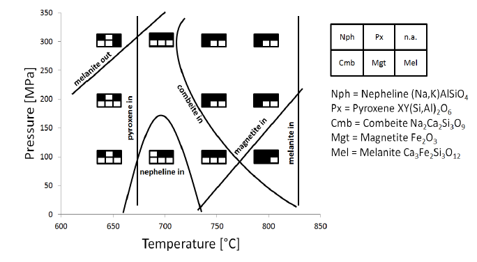

```{r internal_setup, echo=FALSE}
colorize <- function(x, color) {
  if (knitr::is_latex_output()) {
    sprintf("\\textcolor{%s}{%s}", color, x)
  } else if (knitr::is_html_output()) {
    sprintf("<span style='color: %s;'>%s</span>", color, 
      x)
  } else x
}
```

## Preface

In petrology it is common to be confronted with or thinking about mineral phase stability. Which minerals form in a certain spot (of melt) is a complex matter depending not only on the chemical composition but also on a multitude of physical factors. The most prominent parameters are probably temperature and pressure, but they are far from being the only variables. 
  
  For example there is oxygen fugacity, a somewhat arcane concept describing the level of oxidation of a magma, which potentially has a huge impact on the phase assemblage that forms. Michael Anenburg has been writing a lot about this fascinating topic and highly recommend his Twitter tutorials.

```{r tweet, echo = FALSE}
blogdown::shortcode("tweet", "1251831777754181632")
```

  
  But I am digressing. Phase stability data, by and at large, can be obtained mostly through three ways: 
  
  1. You can do an petrological experiment. You put some rock powder into what is basically a very sophisticated oven and have total control over the parameters (well, in theory, at least). The downside is that this approach is slow and laborious. Access to experimental facilities is restricted and operating pressure vessels requires special training. Also some of them have a tendency to explode and wreck varying degrees of havoc along the way.
  2. You can investigate a natural rock sample, trying to figure out the environment which lead to its formation e.g. by applying geothermometers and geobarometers. It is a fascinating field and I should write a blog post about it one day. The downside here is that those methods often come with some significant error-bars.
  3. The third method I can think of is to make use of thermodynamic modelling. The advantage clearly is that this approach comes at a fraction of the cost (both money and time) of the other two and is assumed to be considerably more accurate than classical geothermometry and co. A downside is that thermodynamic modeling requires a lot of knowledge about both petrology and the modeling technology of your choice, before you can even start creating anything insightful. Also, most modern petrology-centered modeling tools I know about have rather crude interfaces that can considerably hamper your workflow.
  
  Whatever your line of petrological work is: after obtaining phase stability data, the next big task is to turn that data into a compelling visualization. The classical way to do so is creating a [Phase-Diagram](https://en.wikipedia.org/wiki/Phase_diagram). Here is an example of one I did many years ago for my master thesis:
  


  So here we see basically two main features. There is some kind of table-like graphical indicator displaying the phase assemblage for given parameter-combinations. Then there are some annotated lines, stating explicitly when a phase joins or leaves the assemblage. I thought it wouldn't be so hard to translate these two relatively simple features into code, so that we could have some fun automatizing this otherwise slightly dull task. We will see about that.
  
  
## Preparing Input Data
  
  The above phase-diagram was drawn by hand in a [vector graphics](https://en.wikipedia.org/wiki/Vector_graphics) program. That's ok if you only have a couple of small data-sets, but especially when you work with modeling data, it would be better to have an automatic approach that gives you a fast visual feedback of what you are dealing with. That would come with the additional advantage of making your work reproducible and therefore potentially more attractive to collaborators and reviewers. In this blog-post we will explore the possibilities offered in [R](https://www.r-project.org/) to generate phase diagrams. For a start, let's try to recreate my old master thesis's illustration with code.

  
```{r setup, warning=FALSE, message=FALSE}
# These are packages needed for data wrangling.
# Note that their loading order is not arbitrary, 
# as e.g. the function 'select' exists for both the raster and the tidyverse
# package (via dplyr) and we will need only dplyr::select()

library(raster)
library(sf)
library(smoothr)
library(tidyverse)
library(ggspatial)


# These are packages to style output such as tables and plots
library(kableExtra)
library(paletteer)
library(gridExtra)
library(grid)
library(ggpmisc)

# You can download the phase stability data from my old thesis from github
df_exp <- readr::read_csv("https://raw.githubusercontent.com/Ignimbrit/exchange/master/data/2020/OL_EXP_PHASES.csv")

phases_exp <- df_exp %>% dplyr::select(-P_MPa, -T_C) %>% colnames() 

# Let's inspect the data!
kableExtra::kable(df_exp)
```
  
  You can see that we have to independent variable `T_C` (Temperature in Celsius) and `P_MPa` (Pressure in Mega-Pascal) that are combined to form a regular, rectangular grid. Each combination of P and T represents an actual experiment that was performed in a [CSPV](https://www.mineralogie.uni-hannover.de/542.html?&L=1) and later analyzed by [microprobe](https://en.wikipedia.org/wiki/Electron_microprobe). From the analyses we know which minerals showed up (`TRUE`) at a given combination of conditions.

```{r inspect_exp}
# We sould also take a quick look at some kind of preliminary graph to
# get a 'feeling' for the visual space we will be working with

df_exp %>% tidyr::pivot_longer(Combeite:Pyroxene) %>% 
  dplyr::filter(value == TRUE) %>% 
  ggplot(aes(x = T_C, y = P_MPa, color = name)) +
  geom_jitter(width = 10, height = 10, size = 3)
  

```

So this is what we will be trying to transform into a phase diagram. The way we will attempt that is essentially to draw some kind of polygons of convex hulls around groups of point clouds as shown above. This is why at the startup of this script we loaded some packages usually associated with spatial data manipulation. Those packages provide us with a comprehensive toolbox for manipulating polygons. That we can leverage spatial algorithms for ggplot2 plots is possible thanks to the ggspatial package written by [Dr. Dewey Dunnington](https://twitter.com/paleolimbot) who demonstrated the approach in [this gist](https://gist.github.com/paleolimbot/e854c098c6d95330c361014276b5a8db), related to an excellent [blog post about hydrogeochemical modelling](https://fishandwhistle.net/post/2018/pourbaix-ish-diagrams-using-phreeqc-and-r/).

  In order to bring `df_exp` in a form that can be plotted as a phase diagram we need to do quite a lot of data wrangling. I realize that this might not be an interesting read for everyone, so I've hidden the details of the data transformation in the folded tab below. You can look at it by clicking the red textline. If you are only interested in the actual plotting procedure, you can keep it folded and just move on.

<details><summary> `r colorize("Show me the detailed data treatment procedure!", "red")`</summary>

`r colorize("Alright, welcome to the machine room of this blog post. Here we will define a set of functions to transform the table shown above into data formats accepted by ggplot2's geoms. I will be working with functions rather than manipulating the input data directly, so that we can easily apply our workflow to other datasets.", "grey")`


```{r functions}

# First let's create away to find all existing combinations of phases
# in the dataset and assign a group-variable to each of them

phase_group <- function(x, ...){

  # the input of the function is supposed to be a dataframe from which 
  # phase-related coloumns can be selected just like with dplyr::select()
  df <- x %>% dplyr::select(!!!enquos(...))
  force(df)
  
  phase_names <- colnames(df)
  
  # the next step ist to find the phase assemblage coexisting with each
  # combintation of P & T
  phase_list_lgl <- purrr::pmap(as.list(df), c)
  
  phase_list_chr <- vector("list", length = length(phase_list_lgl))
  for(i in seq_along(phase_list_chr)){
    phase_list_chr[[i]] <- phase_names[phase_list_lgl[[i]]]
  }
  
  # now we save the information in a single string (Phase1 + Phase4 + ...)
  # per observation.
  combinations <- purrr::map_chr(
      phase_list_chr,
      .f = paste,
      collapse = " + "
    ) %>% 
    factor(
      levels = sort(unique(.))
    )
  
  # Having a unique string (or rather factor) is nice, but some operations
  # require numbered phase groups
  x %>% mutate(
    phase_combo = combinations
  ) %>% 
    mutate(
      group_no = as.integer(phase_combo)
    )
}


# Now that we can identify the unique phase assemblage for each observation
# we can make a raster. Think: x = T, y = P, z = assemblage no.
# This way we can descirbe the area that is occupied by a certain assemblage.
polygonize_phasegroup <- function(x, y, z){
  
  #Note that this function expects a regular grid
  raster::rasterFromXYZ(
    data.frame(
      x = x,
      y = y,
      z = z
    )
  ) %>% # converting to polygons
    raster::rasterToPolygons(dissolve = TRUE) %>% 
    sf::st_as_sf() %>% 
    ggspatial::df_spatial() # converting to ggplot2 polygon notation
}


# What we did to identify the area occupied by a certain combination of
# phases we can now more or less repeat to find the stability field 
# for a single phase
find_phase_border <- function(
  phase_exists, x, y, raster_res = c(NA, NA), size = 1, smooth_factor = 1
){
  rawdat <- dplyr::bind_cols(x = x, y = y, z = phase_exists)
  df <- rawdat %>% 
    dplyr::filter(z) %>% 
    dplyr::mutate(z = as.integer(z))
  
  # Make sure we have a regular grid 
  phase_grid <- expand.grid(x = sort(unique(df$x)), y = unique(sort(df$y))) %>% 
    dplyr::left_join(
      df,
      by = c("x", "y")
    ) %>% 
    as.data.frame()
  
  phase_grid$z[is.na(phase_grid$z)] <- 0
  
  # translate to polygon, smoothing the edges a little
  coord_sf <- raster::rasterFromXYZ(
    phase_grid,
    res = raster_res
  ) %>%  
    raster::rasterToPolygons(dissolve = TRUE) %>%
    sf::st_as_sf() %>% 
    dplyr::filter(z == 1) %>% 
    smoothr::smooth(method = "ksmooth", smoothness = smooth_factor) 
  
  # resize to avoid overlaps in the plot
  centroid <- sf::st_centroid(coord_sf)
  smaller_sf <- (coord_sf - centroid) * size + centroid
  
  # translate to ggplot2 geom_polygon notation
  smaller_sf %>%
    sf::st_set_geometry("geometry") %>% 
    ggspatial::df_spatial()
  
}


```

</details>  
  
  (...)
  
  
  ## Example 1: Experimental Data set
  
  So here we continue equipped with some additional functions we defined in the folded chunk. Now we can draw polygons that will mark the area occupied by a distinct assemblage.

```{r phase_polygons, message=FALSE, warning=FALSE}

# Create grouping variable for phase assemblages and assign to every 
# combination of P & T

df_exp_grouped <- phase_group(df_exp, Combeite:Pyroxene)

# make polygons for unique combinations of minerals
polygons_exp <- polygonize_phasegroup(
  x = df_exp_grouped$T_C,
  y = df_exp_grouped$P_MPa,
  z = df_exp_grouped$group_no
) %>% 
  left_join(
    select(df_exp_grouped, group_no, phase_combo),
    by = c("z" = "group_no")
  )

# Inspect what we just created
ggplot(
  data = polygons_exp,
  mapping = aes(
    x = x, y = y, z = z, fill = feature_id
  )
) +
  geom_polygon()
```

Well, this goes in the right direction but there is still quite some work to do. We can see now the area associated with a distinct assemblage, but the labeling sure can be improved a lot. Second, we should also find a way to communicate clearly, which change in mineral stability leads to the modification of an assemblage (e.g. is magnetite coming in or going out?). Let's see if we can make the info we've got a bit more explicit in the plot. We will start by collecting the phase stability areas of the single minerals.

```{r minborders, message=FALSE, warning=FALSE}

# make polygons showing the area of stability for every single phase
# Note that the function "find_phase_border" was prepared in the folded chunk.
phase_borders_exp <-  purrr::map(
  dplyr::select(df_exp_grouped, Combeite:Pyroxene),
  find_phase_border,
  x = df_exp_grouped$T_C,
  y = df_exp_grouped$P_MPa,
  raster_res = c(50, 100),
  size = 1.1
)

# gather the polygons associated with the minerals in a single tibble
border_df_exp <- purrr::map2_dfr(
  phase_borders_exp,
  names(phase_borders_exp),
  function(.x, .y){mutate(.x, Phase = .y)}
) 

```

Next we want to reproduce the table-shaped annotations from the original drawing that give such a nice and quick overview about the composition of the assemblage

```{r inset_graphs}

# abbreviate the mineralnames to save space
# c.f. https://www.unige.ch/sciences/terre/research/Groups/mineral_resources/opaques/ore_abbreviations.php
abbrv <- c("cmb", "crn", "mgt", "mel", "nph", "cpx")

# The table-shaped annotation label of the assemblage should be associated
# with the assemblage polygons we've seen in the last plot

generic_input <- polygons_exp %>% 
  dplyr::group_by(phase_combo) %>% 
  dplyr::summarize(x = mean(x), y = mean(y)) %>% 
  dplyr::mutate(
    phase_list = stringr::str_split(phase_combo, pattern = " \\+ ")
  ) %>% 
  dplyr::mutate(
    phase_presence = purrr::map(
      phase_list,
      function(x, table) {as.integer(match(x, table, nomatch = 0) > 0) + 1},
      x = phases_exp
    )
  )

# The next part is a bit tricky. There is no standard way of getting the 
# kind of annotation we want into ggplot2. We have to go one level deeper
# and construct our own graphical objects ("grob") using a couple of
# low level graphical functions from packages {grid} and {gridExtra}

catcher_outer <- vector("list", length = nrow(generic_input))
for(i in seq_along(catcher_outer)){
  
  catcher_inner <- vector("list", length = length(abbrv))
  for (j in seq_along(abbrv)) {
    catcher_inner[[j]] <- grid::grobTree(
      grid::rectGrob(
        gp = grid::gpar(
          fill = c("black", "white")[generic_input$phase_presence[[i]][j]], 
          lwd = 2
        )
      ), 
      grid::textGrob(abbrv[j], gp = grid::gpar(fontsize = 10))
    )
  }
  
  catcher_outer[[i]] <- gridExtra::arrangeGrob(grobs = catcher_inner, ncol = 3)
  
}

# Collect the objects we just build along with some metadata in a tibble
grob_df <- generic_input %>% 
  dplyr::mutate(
    grob = catcher_outer,
    width = 0.17,
    height = 0.17
  )

```

Finally we now should have all the information/data we need for a pleasant plot.

```{r exp_plot_complete}
ggplot() +
  geom_polygon( # phase assemblage polygons
    data = polygons_exp,
    mapping = aes(
      x = x, y = y, fill = feature_id, group = piece_id
    ),
    color = "black",
    show.legend = FALSE,
    alpha = 0.25
  ) +
  geom_polygon( # single mineral phase polygons
    data = border_df_exp,
    aes(
      x = x, y = y, color = Phase
    ),
    fill = NA,
    size = 1.25
  ) +
  ggpmisc::geom_grob( # custom annotation grobs
    data = grob_df,
    aes(
      x = x, y = y, label = grob, vp.width = width, vp.height = height
    )
  ) +
  coord_cartesian(xlim = c(625, 825), ylim = c(50, 350), expand = FALSE) +
  paletteer::scale_fill_paletteer_d("nord::algoma_forest") +
  paletteer::scale_colour_paletteer_d("yarrr::appletv", direction = 1) +
  labs(
    y = "Pressure [MPa]", x = "Temperature [°C]",
    title = "Experimental Phase Stability of Nephelinitic Melt"
  ) +
  theme_bw()

```

So that's the final plot. There are still a few differences to the original. On the one hand, custom text annotations for lines are hard to automatize, on the other hand, drawing your phase diagram automatically from data makes it easier to use colors. One could opt to use different linetypes for the mineral stability borders, but personally I found the color coding to be more clear. The plot could also use some manual fine tuning on the edges, but fortunately it's very easy to export ggplot2 objects to `svg`, so one could continue in e.g. [Inkscape](https://inkscape.org/de/).  
  
  
  ## Example 2: Thermodynamic Model (MELTS) Data set

[MELTS](http://melts.ofm-research.org/) is "a software package designed to facilitate thermodynamic modeling of phase equilibria in magmatic systems. It provides the ability to compute equilibrium phase relations for igneous systems over the temperature range 500-2000 °C and the pressure range 0-2 GPa."  
  
  Over the last years, MELTS has (to my knowledge) become one of the most popular thermodynamic modeling suites for petrology-related research. The advantages of modelling over experimental approaches we have already discussed. Now we will look at a modeled data set with a much much finer temperature resolution than ever would be possible to accomplish in a lab.

```{r MELTS_download, message=FALSE}

# You can download the data we will use from GitHub:
df_MELTS <- read_csv("https://raw.githubusercontent.com/Ignimbrit/exchange/master/data/2020/MELTS_DAWN_simplified.csv")

phases_MELTS <- df_MELTS %>% dplyr::select(-P_MPa, -T_C) %>% colnames() 

df_MELTS

```
  
  This modelling data was kindly provided by [Dr. Dawn Ruth](https://twitter.com/rockdoc11) who, by the way, also gave me the initial impulse to look into phase diagram creation in R. I have slightly simplified the MELTS output to make the table fit the needs for this demonstration. As you can see, we are again provided with two independent variables `T_C` and `P_MPa` and a set of six dependent variable columns, indicating the presence of various mineral phases for a given P-T. Unlike with the experimental data set, however, this time we have 266 observations (=rows in the table) instead of just 12. Again we start with a quick visualization of the shape of data we got here.
  
```{r inspect_MELTS}

df_MELTS %>% tidyr::pivot_longer(biotite:spinel) %>% 
  dplyr::filter(value == TRUE) %>% 
  ggplot(aes(x = T_C, y = P_MPa, color = name)) +
  geom_jitter(width = 0, height = 10)
  
```

Note that unlike in the experimental data set, the data in `df_MELTS` is irregularly spaced. There are observations for 0.5, 1, 2 and 5 kbar (but not for e.g. 1.5 or 3 kbar). Also there are observations at higher temperatures, the higher the pressure in the simulation was. Because of the way we have build our tools for creating phase diagrams, we will first have to rectify those "holes" in the data.

```{r MELTS_regularize}

# First we get rid of decimal places. We do not need to be that precise for the
# diagram and they make creating a regular grid unecessary difficult.

df_MELTS_simple <- df_MELTS %>% 
  dplyr::mutate(
    T_C = as.integer(round(T_C)),
    P_MPa = as.integer(P_MPa)
    )


# The regular grid shall have a T-resolution of 1°C and a P-resolution of
# 50 MPa, which (more or less) corresponds to the steps modeled in MELTS
# in this case.

range_MELTS_T <- seq(
  min(df_MELTS_simple$T_C), 
  max(df_MELTS_simple$T_C), 
  1
  )

range_MELTS_P <- seq(
  min(df_MELTS_simple$P_MPa), 
  max(df_MELTS_simple$P_MPa), 
  50
  )


# Next we fill in the holes in our regular grid.
# We do so by "wandering down" the pressure (later the temperature) sequence
# and whenever we encounter missing information about the presence of mineral
# phases, we assume nothing has changed since the last time we saw them.
# This is not so much different from what you would do when drawing a phase-
# diagram by hand. That workflow was inspired by a vignette of the tsibble
# package originally adressing missing values in time-series data
# https://tsibble.tidyverts.org/articles/implicit-na.html

grd_MELTS <- as.data.frame(expand.grid(range_MELTS_T, range_MELTS_P)) %>% 
  dplyr::rename(T_C = Var1, P_MPa = Var2) %>% 
  dplyr::arrange(dplyr::desc(P_MPa), dplyr::desc(T_C)) %>% 
  dplyr::left_join(df_MELTS_simple, by = c("T_C", "P_MPa")) %>% 
  dplyr::group_split(P_MPa) %>% 
  purrr::map_dfr(
    .f = tidyr::fill, biotite:spinel,  .direction = "down"
    ) %>% 
  dplyr::group_split(T_C) %>% 
  purrr::map_dfr(
    .f = tidyr::fill, biotite:spinel,  .direction = "down"
    )%>% 
  dplyr::group_split(T_C) %>% 
  purrr::map_dfr(
    .f = tidyr::fill, biotite:spinel,  .direction = "up"
    )

grd_MELTS %>% tidyr::pivot_longer(biotite:spinel) %>% 
  dplyr::filter(value == TRUE) %>% 
  ggplot(aes(x = T_C, y = P_MPa, color = name)) +
  geom_jitter(width = 0, height = 10)
  

```

  As you can see, the data is now both rectangular and regular and we can apply our established workflow of creating a raster and subsequently polygonizing it.

```{r MELTS_polygonize, message=FALSE, warning = FALSE}

# Identify unique mineral assemblages
df_MELTS_grouped <- phase_group(grd_MELTS, biotite:spinel)

# Create assemblage polygons
polygons_MELTS <- polygonize_phasegroup(
  x = df_MELTS_grouped$T_C,
  y = df_MELTS_grouped$P_MPa,
  z = df_MELTS_grouped$group_no
)%>% 
  left_join(
    select(df_MELTS_grouped, group_no, phase_combo),
    by = c("z" = "group_no")
  )

# create single phase stability polygons
phase_borders_MELTS <-  purrr::map(
  dplyr::select(df_MELTS_grouped, biotite:spinel),
  find_phase_border,
  x = df_MELTS_grouped$T_C,
  y = df_MELTS_grouped$P_MPa,
  raster_res = c(1, 50),
  size = 1.02,
  smooth_factor = 4
) %>% 
  purrr::map2(
    .x = .,
    .y = seq(1, length(.)),
    function(.x, .y) {
      mutate(
        .x, 
        piece_id = factor(
          as.double(
            as.character(
              piece_id
            )
          ) + .y
        )
      )
    }
  )

# gather the polygons associated with the minerals in a single tibble
border_df_MELTS <- purrr::map2_dfr(
  phase_borders_MELTS,
  names(phase_borders_MELTS),
  function(.x, .y){mutate(.x, Phase = .y)}
) 

```


```{r label_MELTS}
# Create table-like assemblage markers as inset plots

# I will abbreviate the mineralnames to save space
# c.f. https://www.unige.ch/sciences/terre/research/Groups/mineral_resources/opaques/ore_abbreviations.php
abbrv_MELTS <- c("bt", "cx", "fs", "ol", "ox", "sp")

# The table-shaped annotation label of the assemblage should be associated
# with the assemblage polygons we've seen in the last plot
generic_input_MELTS <- polygons_MELTS %>% 
  dplyr::group_by(phase_combo) %>% 
  dplyr::summarize(
    x = mean(x), 
    y = mean(y)
    ) %>% 
  dplyr::mutate(
    phase_list = stringr::str_split(phase_combo, pattern = " \\+ ")
  ) %>% 
  dplyr::mutate(
    phase_presence = purrr::map(
      phase_list,
      function(x, table) {as.integer(match(x, table, nomatch = 0) > 0) + 1},
      x = phases_MELTS
    )
  )


# Build the grobs
catcher_outer <- vector("list", length = nrow(generic_input_MELTS))
for(i in seq_along(catcher_outer)){
  
  catcher_inner <- vector("list", length = length(abbrv_MELTS))
  for (j in seq_along(catcher_inner)) {
    catcher_inner[[j]] <- grid::grobTree(
      grid::rectGrob(
        gp = grid::gpar(
          fill = c("black", "white")[generic_input_MELTS$phase_presence[[i]][j]], 
          lwd = 1.2
        )
      ), 
      grid::textGrob(abbrv_MELTS[j], gp = grid::gpar(fontsize = 7.5))
    )
  }
  
  catcher_outer[[i]] <- gridExtra::arrangeGrob(grobs = catcher_inner, ncol = 3)
  
}

# Collect the objects we just build along with some metadata in a tibble
grob_df_MELTS <- generic_input_MELTS %>% 
  dplyr::mutate(
    grob = catcher_outer,
    width = 0.08,
    height = 0.08
  )


```

As the modeled data set is substantially larger than the experimental one we've been examining above, we will have to make some visual adjustments to our final phase diagram plot.  

Creating the annotation labels for the MELTS data is somewhat more difficult than for the experimental data. With the experimental data, we positioned those table-shaped annotations centrally within the polygon of the associated assemblage. This works (sometimes) for smaller plots with a limited number of different assemblages, but if we'd use that approach to annotate the MELTS-data phase diagram, the [grobs](https://bookdown.org/rdpeng/RProgDA/the-grid-package.html#grobs) would overlap, rendering them unreadable.  
  
  To automatically avoid this issue, we would need some kind of repel-algorithm similar to the functionality provided by the [ggrepel](https://cran.r-project.org/web/packages/ggrepel/vignettes/ggrepel.html) package. Unfortunately, ggrepel applies to text annotations only with no simple way to use it for custom grobs. Developing our own repel algorithm on the other hand is way beyond the scope of this blog article, that by now has already escalated significantly beyond what I had initially envisioned for today's issue.  
  
  To avoid this problem for now I went with an admittedly dodgy fix of making the annotation grobs smaller and adding the `position = position_jitter()` argument to `ggpmisc::geom_grob`. If this was a plot meant for publication e.g. in a journal, one would probably have to invest the time to adjust each annotation position manually and maybe also set up an additional legend. For now we shall proceed as follows:
  
```{r MELTS_plot_complete}
ggplot() +
  geom_polygon(
    data = polygons_MELTS,
    mapping = aes(
      x = x, y = y, fill = feature_id, group = piece_id
    ),
    color = "black",
    show.legend = FALSE,
    alpha = 0.3
  ) +
  geom_polygon(
    data = border_df_MELTS,
    aes(
      x = x, y = y, color = Phase, group = piece_id
    ),
    fill = NA,
    size = 1.25
  ) +
  ggpmisc::geom_grob(
    data = grob_df_MELTS,
    aes(
      x = x, y = y, label = grob, vp.width = width, vp.height = height
    ),
    position = position_jitter(width = 15, height = 15, seed = 42)
  ) +
  coord_cartesian(xlim = c(900, 1250), ylim = c(25, 525), expand = FALSE) +
  paletteer::scale_fill_paletteer_d("ggsci::default_igv", direction = 1) +
  paletteer::scale_colour_paletteer_d("yarrr::appletv", direction = 1) +
  labs(
    y = "Pressure [MPa]", x = "Temperature [°C]",
    title = "Phase Stability of a Magma Modeled with MELTS"
  ) +
  theme_bw()

```

## Concluding Remarks

Creating a workflow to plot mineral phase stability diagrams directly from data and with a minimum of manual alteration has proven to be quite a laborious task in itself. If you are looking for something similar, I hope I could provide you here with some inspiration on how to tackle some of the more arcane problems of confining areas of shared properties within a cartesian grid system. Now that the tools presented in this blog post exist, I can definitely see myself applying them in the future in quite a range of situations, not all of them necessarily related to petrology. As the whole workflow is based around the ideas of grouped polygons, much of it should work for certain spatial issues, too.  