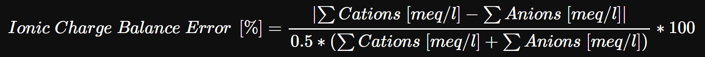

When working with water chemistry you are often presented with analytic results either send to you by a lab or probably even measured by yourself. From that analysis (usually from several) you are then supposed to draw insight about what is going on in your river/pond/aquifer. In order to be able to do that, it is mandatory that you can rely on your data. After all, any conclusion drawn from a dataset can never be better than the data itself.

  In water chemistry, it is a good custom to check the plausibility of incoming analyses and one fundamental tool to do that is the determination of the ionic charge balance error (ICBE). In Germany, where I happen to live and work, the ICBE, by convention apparently stemming from "Deutscher Verband für Wasserwirtschaft und Kulturbau e.V. (DVWA) Heft 128/92" (though nobody seems to be able to dig up the original reference any more), is calculated using the following formula: 
  

  
  That formula comes with a convention on how to interpret the results:
  
* if the sum of anions and cations both are <= 2 meq/l, an ICBE <= 5% is acceptable
* if that sum is higher for either cations or anions, an ICBE <= 2% is acceptable
  
It is worth mentioning that Germany has since 1992 followed kind of their own path on this. The international standard formula comes without the factor "0.5" in the denominator. I don't know whether the same limits on what an acceptable charge balance error is apply.

  Anyway, the formula to calculate the ICBE looks straightforward enough, so it should be no problem to apply it to your water data, right? Alas, there are again a couple of catches. I already mentioned, that one might have to modify the formula, depending on whether you work in a German or an international setting. Also, sometimes you might need to know the exact ICBE, while on other occasions it would be more handy to just get a quick feedback on whether your analysis passes the test or not. Luckily, the [R](https://www.r-project.org/) functional approach to programming allows us to tackle all this disambiguity with reusable and flexible code snippets.
  
  Lastly, for people new to water chemistry (and we all have at some point been there), getting your analysis into that formula can be challenging itself. What is an anion, what is a cation? And which anions and cations do I need to have measured to make a meaningful ICBE?. What does that strange unit meq/l refer to? I would like to discuss these issues at length here, too, as many explanations on the topic I found online again seemed to cover only parts of the whole story.
  
  Let's start by getting us some water analyses!

```{r janitoring, include=FALSE}
knitr::opts_chunk$set(
  message = FALSE,
  warning = FALSE
)
```

```{r setup}
library(tidyverse)     # Data wrangling and plotting
library(PeriodicTable) # Look up element properties
library(kableExtra)    # Table output formatting

# You can download the dataset for this tutorial from Github.
# It is a random sample of 100 Groundwater measurements
# made in the German state of North Rhine-Westphalia in 2018.

# The original dataset is published under the following licence:
# Datenlizenz Deutschland 2.0
# https://www.govdata.de/dl-de/by-2-0
# OpenHygrisC_gw-messstellen-messwerte_EPSG25832_CSV.zip
# https://www.opengeodata.nrw.de/produkte/umwelt_klima/wasser/hygrisc/

raw <- read_csv(
  "https://raw.githubusercontent.com/Ignimbrit/exchange/master/data/2020/HygrisC_GWsample.csv"
  ) %>% 
  select(-Lizenz)

# All Concentrations in `raw` are given in mg/l
kable(raw) %>% 
  kable_styling() %>% 
  scroll_box(width = "700px", height = "400px")

```
  
<b></b>
  
  In its current form, that table is not easy to work with in R. We need a simple way to apply transformations to all measurements at once. It is therefore better to organize the data in columns, so we can readily push them into tidyverse functions. Also we need to know which elements we actually deal with.
  
```{r calc}
df_base <- raw %>% 
  pivot_longer(Na:Cl, names_to = "Param", values_to = "mg/l")

# Check which ions were analyzed in the dataset
df_base$Param %>% unique() %>% paste0(collapse = ", ") %>% cat()
```

  So we have actually quite a broad inventory of elements and molecules here. All of those can, and if they are available they should, go into your ICBE calculation. However, in many contexts it might already be possible to obtain good results when only Na, K, Mg, Ca, HCO3, SO4 & Cl are available, as they often constitute the bulk of dissolved ions in natural waters. 
  
  In order to derive gainful insight about our measurements of those parameters, though, we need to have additional knowledge about their chemical properties.

```{r chemdata}

# The mass of an ion can be acquired from {PeriodicTable} function `mass`
# The charge, unfortunately, you *have to know*. Explaining this basic concept
# of aqueous chemistry is a bit beyond the scope of this blog post.
df_specs <- tribble(
  ~Param, ~charge, ~`mass [g/mole]`,
    "Na",      1L,   mass("Na"),
     "K",      1L,   mass("K"),
    "Mg",      2L,   mass("Mg"),
    "Ca",      2L,   mass("Ca"),
    "Mn",      2L,   mass("Mn"),
    "Fe",      2L,   mass("Fe"),
  "HCO3",     -1L,   mass("H") + 1*mass("C") + 3*mass("O"),
   "NO3",     -1L,   mass("N") + 3*mass("O"),
   "NH4",      1L,   mass("N") + 4*mass("H"),
   "PO4",     -3L,   mass("P") + 4*mass("O"),
   "SO4",     -2L,   mass("S") + 4*mass("O"),
    "Cl",     -1L,   mass("Cl")
)

```
  
  Now that we do have our analyses and know the properties of the ions we are dealing with, we can transform the concentrations that we've been given in mg/l (milligram per liter) into meq/l (millimole equivalent per liter), the unit that goes into the ICBE formula. mg/l refers to the mass of a substance (e.g. chloride) solved in a liquid (water, in this case). That much is easy to understand. But what is mole and what does mole equivalent mean?. 
  
  While the unit mg (1/1000 g) refers to the mass of the substance, mole refers to its amount, the very number of atomic particles of a certain kind. As different kinds of particles, say Na and Cl, have different masses, weighing in the same amount of Na and Cl with a balance will provide you with a different number of particles. One mole is short hand for 6.02214076×10^23 particles, just like a dozen is short hand for 12.
  
  To go from a mass in g to an amount of particles in mole you need to know the molar mass of an element or molecule. The molar mass for every element can be read from any decent [periodic table](https://en.wikipedia.org/wiki/Periodic_table) or called in R directly with `PeriodicTable::mass()`. It comes in g/mole, so if you divide your substance mass in g by the element's molar mass, the g will cancel out and you end up with your substance amount in mole.
  
  Why is it important to know how many particles exactly you have? Because as we are dealing with ions here, every particle comes with a charge and we need to add up those numbers. And this is where the transition from "mole" to "mole equivalent" comes in. All ions are charged. But some ions are more charged than others. As we are trying to ultimately calculate a charge balance here, we will eventually have to multiply the amount of particles we have with the amount of charge that is assigned to the individual particles.
  
  That was a lot of text that probably simultaneously bored the people with a chemical background and confused those without. Therefore now let's jump back to the code and look at how to actually perform the described unit conversion.
  
```{r Reform}
df_mole <- df_base %>% 
  left_join( # First I'll attach the ion properties to my concentrations
    df_specs, by = "Param"
  ) %>% 
  mutate(    # Next let's add a column specifying whether charge is + or -
    iontype = case_when(
      charge > 0 ~ "Cation",
      charge < 0 ~ "Anion"
    )
  ) %>% 
  mutate(    # Here is the actual unit conversion, as explicit as possible
    `g/l`     = `mg/l`    / 1000,
    `mole/l`  = `g/l`     / `mass [g/mole]`,
    `mmole/l` = `mole/l`  * 1000,
    `meq/l`   = `mmole/l` * abs(charge) # number of particle times their charge
  )

# Now that we have the correct unit, all we need to do is sum up
# our anions and cations.
df_Ionsum <- df_mole %>% 
  group_by(well_no, date, iontype) %>% 
  summarise(ionsum = sum(`meq/l`)) %>% 
  ungroup() %>% 
  pivot_wider(names_from = iontype, values_from = ionsum)

```

  With our analytic data in the right shape and unit, we can go ahead and write a function that takes the sum of anions and cations and calculates the ICBE.

```{r function construction}

ionic_charge_error <- function(
  sum_cations, sum_anions, 
  absolute = TRUE,         # differentiate between positive & negative error?
  mode = "GER",            # which calculation scheme to use?
  logical = FALSE,         # return only whether test was passed?
  discard_threshold = "default"  # How much error is too much?
){
  
  # Should the result be a positive number only (the default)?
  if(absolute == TRUE){
    numerator <- abs(sum_cations-sum_anions)
  } else {
    numerator <- sum_cations-sum_anions
  }
  
  # Use the deviant German calculation scheme?
  if(mode == "GER"){
    denominator <- (sum_cations+sum_anions)*0.5
  } else if(mode == "INT"){
    denominator <- (sum_cations+sum_anions)
  } else {
    stop("mode not supported")
  }
  
  # Calculate the actual charge balance
  ionic_charge_error <- numerator/denominator*100
  
  # Sometimes you do only care whether the charge error is acceptable or not
  if(logical == TRUE){
    
    if(discard_threshold == "default"){
      # This is another (probably German?) convention
      if(any(c(sum_anions, sum_cations) > 2)){limit <- 2L} else {limit <- 5L}
    } else {
      # Alternatively, You can just supply your own, personal threshold
      limit <- discard_threshold
    }
    
    if(ionic_charge_error > limit){
      FALSE
    } else {
      TRUE
    }
  } else {
    ionic_charge_error
  }
}


```

  As you can see, an R function allows a lot of flexibility for advanced users while, by setting reasonable defaults, still remains easily applicable even for people not familiar with every detail of the underlying concept.
  
  Finally, we can now have a look at the quality of those water analyses I dug up.

```{r demonstration}

df_icbe <- df_Ionsum %>% 
  mutate( # I'll try both modes of the function: numeric and logical
    charge_error = map2_dbl(Cation, Anion, ionic_charge_error),
    keep = map2_lgl(Cation, Anion, ionic_charge_error, logical = TRUE)
  )

# The result is a large data.frame with lot's of values.  
# To get a better understanding of the results, a plot can help.

ggplot(
  data = df_icbe %>% 
    mutate(
      `acceptable error` = map2_chr(
        Anion, Cation, function(x, y){
          if(any(c(x, y) > 2)){"2%"} else {"5%"}
        }
      ) 
    ),
  mapping = aes(
    x = charge_error,
    fill = `acceptable error`
  )
) +
  geom_histogram(
    binwidth = 1, color = "black", boundary = 0
  ) +
  geom_vline(
    aes(
      xintercept = parse_number(`acceptable error`),
      color = `acceptable error`
      ),
    size = 2
    ) +
  scale_fill_manual(values = c("firebrick", "steelblue")) +
  scale_color_manual(values = c("red", "blue")) +
  scale_x_continuous(breaks = seq(0, 50, 2)) +
  scale_y_continuous(breaks = seq(0, 20, 2)) +
  labs(
    title = "Calculated Ionic Charge Balance Error",
    subtitle = "100 groundwater samples collected 2018 in North Rhine-Westphalia, Germany",
    x = "charge balance error in percent"
  ) +
  theme_bw() +
  theme(
    axis.text = element_text(size = 11, color = "black"),
    axis.title = element_text(size = 12, color = "black"),
    legend.text = element_text(size = 11, color = "black"),
    legend.title = element_text(size = 12, color = "black"),
    legend.position = "bottom",
    legend.direction = "horizontal"
  )

```

  As you can see, the vast majority of analyzed samples (97 in 100) come with a rather high mineralization, leading to either cationsum or anionsum being > 2 meq/l. Only 28 out of 100 samples end up having an acceptable charge balance. Reasons for this can be manifold and range from bad sampling over laboratory issues to the presence of organic contaminants that might skew your charge balance. Either way, if your dataset has a charge balance rate that looks like the one in the histogram above, you should probably talk to your sampler.